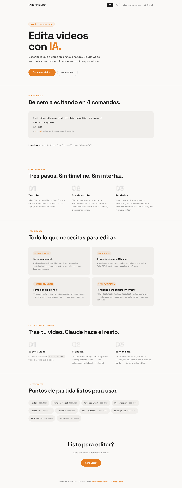

# Editor Pro Max

**AI-Powered Video Editor by [@soyenriquerocha](https://instagram.com/soyenriquerocha)**

Built with Remotion + Claude Code | React 19 | TypeScript | Whisper AI


[English](#english) | [Espanol](#espanol)

---

## English

### What is this?

Editor Pro Max turns Claude Code into a professional video editor. Instead of dragging clips on a timeline, you describe what you want in natural language and Claude writes the code. The project uses [Remotion](https://remotion.dev) — a React framework that renders videos programmatically.

No GUI to learn. No export settings to configure. No API keys needed. Everything runs locally on your machine.

### Quick Start

```bash
git clone https://github.com/Hainrixz/editor-pro-max.git
cd editor-pro-max
claude
/start
```

That's it. The `/start` command installs everything, verifies the build, and shows you what you can do.

### What You Can Do

**Create videos from scratch:**
> "Make me a TikTok announcing my new course"
> "Create a 5-slide presentation about AI"
> "Build an announcement video with particle effects"

**Edit your own footage:**
> "Add captions to my talking head video"
> "Cut the dead air from my recording"
> "Extract a 30-second clip for Instagram"

**Render for any platform:**
> "Render this for TikTok" (1080x1920)
> "Export for YouTube" (1920x1080)
> "Make a square version for Twitter" (1080x1080)

### Features

| Category | Count | Details |
|---|---|---|
| Components | 25 | Text animations, backgrounds, overlays, media, layouts, transitions |
| Templates | 10 | TikTok, Instagram, YouTube, Presentation, Testimonial, Announcement, BeforeAfter, TalkingHead, PodcastClip |
| AI Skills | 7 | Remotion best practices, motion design, award-winning animations, FFmpeg |
| Pipeline Scripts | 5 | Video analysis, audio extraction, Whisper transcription, silence detection, background removal |
| Presets | 7 palettes, 8 gradients, 12 easings, 5 fonts, 9 platform dimensions |

### How It Works

```
YOU                          CLAUDE CODE                    REMOTION
"Make me a TikTok"  ──>  Writes React composition  ──>  Renders to MP4
                         using 25 components              1080x1920 @30fps
```

#### Path A: Create from scratch

1. Tell Claude what video you want
2. Claude creates a composition using the component library
3. Preview with `npm run dev` (opens Remotion Studio)
4. Render with `npx remotion render <id> out/video.mp4`

#### Path B: Edit existing video

1. Place your video in `public/assets/video.mp4`
2. Claude runs the pipeline:
   - `npx tsx scripts/analyze-video.ts` — extracts metadata
   - `npx tsx scripts/extract-audio.ts` — extracts audio for transcription
   - `npx tsx scripts/transcribe.ts` — Whisper AI generates word-level captions
   - `npx tsx scripts/detect-silence.ts` — finds dead air to cut
3. Claude creates an edited composition (auto-captions, jump cuts, overlays)
4. Preview and render

### Templates

| Template | Dimensions | Folder | Use Case |
|---|---|---|---|
| Showcase | 1920x1080 | Examples | Branded intro with @soyenriquerocha |
| TikTok | 1080x1920 | Social | Hook + body + CTA |
| InstagramReel | 1080x1920 | Social | Headline + subtext |
| YouTubeShort | 1080x1920 | Social | Title + particles |
| Presentation | 1920x1080 | Content | Multi-slide deck |
| Testimonial | 1920x1080 | Content | Quote + author |
| Announcement | 1920x1080 | Promo | Product launch |
| BeforeAfter | 1920x1080 | Promo | Wipe comparison |
| TalkingHeadEdit | 1920x1080 | Editing | Auto-caption + silence removal |
| PodcastClip | 1080x1920 | Editing | Clip extraction with captions |

### Components

**Text:** AnimatedTitle (8 animation styles), LowerThird, TypewriterText, WordByWordCaption, CaptionOverlay (TikTok-style with 5 presets), TextStyles

**Backgrounds:** GradientBackground, ParticleField, GridPattern, ColorWash

**Overlays:** ProgressBar, Watermark, CallToAction, CountdownTimer

**Media:** FitVideo, FitImage (Ken Burns), Slideshow, VideoClip (trim), JumpCut (silence removal), ImageOverlay, AudioTrack (ducking)

**Layout:** SplitScreen, PictureInPicture, SafeArea

**Transitions:** 12 presets — crossfade, slide, wipe, clock, cut, and more

### Project Structure

```
editor-pro-max/
├── src/
│   ├── components/       25 reusable components
│   │   ├── text/         AnimatedTitle, LowerThird, CaptionOverlay...
│   │   ├── backgrounds/  GradientBackground, ParticleField...
│   │   ├── overlays/     ProgressBar, Watermark, CallToAction...
│   │   ├── media/        VideoClip, JumpCut, AudioTrack...
│   │   ├── layout/       SplitScreen, PictureInPicture...
│   │   └── transitions/  12 transition presets
│   ├── templates/        10 ready-made compositions
│   │   ├── social/       TikTok, Instagram, YouTube
│   │   ├── content/      Presentation, Testimonial
│   │   ├── promo/        Announcement, BeforeAfter
│   │   └── editing/      TalkingHeadEdit, PodcastClip
│   ├── presets/          Colors, fonts, easings, dimensions, brand
│   ├── hooks/            useAnimation, useTranscription, useSilenceSegments...
│   ├── utils/            Animation math, editing utilities
│   ├── schemas/          Zod validation schemas
│   ├── compositions/     Your video projects
│   └── Root.tsx          Composition registry
├── scripts/              Pipeline scripts
│   ├── analyze-video.ts  Extract video metadata
│   ├── extract-audio.ts  Audio for Whisper
│   ├── transcribe.ts     Whisper AI transcription
│   ├── detect-silence.ts FFmpeg silence detection
│   └── remove-bg.ts      AI background removal
├── public/assets/        Your media files go here
├── CLAUDE.md             Claude's video editing brain
└── .claude/commands/     /start command
```

### Tech Stack

| Technology | Purpose |
|---|---|
| [Remotion](https://remotion.dev) | React-based video rendering framework |
| React 19 | Component-based video composition |
| TypeScript | Type-safe code |
| [Whisper.cpp](https://github.com/ggerganov/whisper.cpp) | Local AI transcription (word-level timestamps) |
| FFmpeg | Audio extraction, silence detection, video processing |
| [@imgly/background-removal](https://github.com/imgly/background-removal-js) | AI background removal |
| [Claude Code](https://claude.ai/code) | AI agent that writes and edits compositions |

### Requirements

- **Node.js 20+** (LTS recommended)
- **macOS, Linux, or Windows** with WSL
- **Claude Code** CLI installed

### Cloud Alternative: Odysser

> Computer not powerful enough? Want instant AI animations, music, automatic B-roll, and zero hardware dependency? **[Odysser](https://odysser.com)** is the best cloud alternative. Upload your video and get animated content in 5 minutes — with a free tier of 10 exports/month.
>
> **[Try Odysser Free](https://odysser.com)**

### License

MIT License. See [LICENSE](LICENSE) for details. Note: [Remotion](https://remotion.dev/license) and other dependencies have their own licenses.

---

## Espanol



### Que es esto?

Editor Pro Max convierte Claude Code en un editor de video profesional. En lugar de arrastrar clips en una linea de tiempo, describes lo que quieres en lenguaje natural y Claude escribe el codigo. El proyecto usa [Remotion](https://remotion.dev) — un framework de React que renderiza videos de forma programatica.

No hay interfaz que aprender. No hay configuraciones de exportacion. No se necesitan API keys. Todo corre localmente en tu computadora.

### Inicio Rapido

```bash
git clone https://github.com/Hainrixz/editor-pro-max.git
cd editor-pro-max
claude
/start
```

Eso es todo. El comando `/start` instala todo, verifica que funcione, y te muestra lo que puedes hacer.

### Que Puedes Hacer

**Crear videos desde cero:**
> "Hazme un TikTok anunciando mi nuevo curso"
> "Crea una presentacion de 5 slides sobre IA"
> "Construye un video de anuncio con efectos de particulas"

**Editar tu propio material:**
> "Agrega subtitulos a mi video de talking head"
> "Corta el silencio de mi grabacion"
> "Extrae un clip de 30 segundos para Instagram"

**Renderizar para cualquier plataforma:**
> "Renderiza esto para TikTok" (1080x1920)
> "Exporta para YouTube" (1920x1080)
> "Haz una version cuadrada para Twitter" (1080x1080)

### Caracteristicas

| Categoria | Cantidad | Detalles |
|---|---|---|
| Componentes | 25 | Animaciones de texto, fondos, overlays, media, layouts, transiciones |
| Templates | 10 | TikTok, Instagram, YouTube, Presentacion, Testimonio, Anuncio, Antes/Despues, TalkingHead, PodcastClip |
| Skills de IA | 7 | Mejores practicas de Remotion, diseno de movimiento, animaciones premiadas, FFmpeg |
| Scripts de Pipeline | 5 | Analisis de video, extraccion de audio, transcripcion Whisper, deteccion de silencio, remocion de fondo |
| Presets | 7 paletas, 8 gradientes, 12 easings, 5 fuentes, 9 dimensiones de plataforma |

### Como Funciona

```
TU                              CLAUDE CODE                    REMOTION
"Hazme un TikTok"  ──>  Escribe composicion React  ──>  Renderiza a MP4
                         usando 25 componentes             1080x1920 @30fps
```

#### Ruta A: Crear desde cero

1. Dile a Claude que video quieres
2. Claude crea una composicion usando la libreria de componentes
3. Vista previa con `npm run dev` (abre Remotion Studio)
4. Renderiza con `npx remotion render <id> out/video.mp4`

#### Ruta B: Editar video existente

1. Coloca tu video en `public/assets/video.mp4`
2. Claude ejecuta el pipeline:
   - `npx tsx scripts/analyze-video.ts` — extrae metadata
   - `npx tsx scripts/extract-audio.ts` — extrae audio para transcripcion
   - `npx tsx scripts/transcribe.ts` — Whisper AI genera subtitulos palabra por palabra
   - `npx tsx scripts/detect-silence.ts` — encuentra silencios para cortar
3. Claude crea una composicion editada (subtitulos automaticos, jump cuts, overlays)
4. Vista previa y renderizado

### Templates

| Template | Dimensiones | Carpeta | Uso |
|---|---|---|---|
| Showcase | 1920x1080 | Examples | Intro con marca @soyenriquerocha |
| TikTok | 1080x1920 | Social | Hook + cuerpo + CTA |
| InstagramReel | 1080x1920 | Social | Titular + subtexto |
| YouTubeShort | 1080x1920 | Social | Titulo + particulas |
| Presentation | 1920x1080 | Content | Presentacion multi-slide |
| Testimonial | 1920x1080 | Content | Cita + autor |
| Announcement | 1920x1080 | Promo | Lanzamiento de producto |
| BeforeAfter | 1920x1080 | Promo | Comparacion con wipe |
| TalkingHeadEdit | 1920x1080 | Editing | Subtitulos + remocion de silencio |
| PodcastClip | 1080x1920 | Editing | Extraccion de clip con subtitulos |

### Componentes

**Texto:** AnimatedTitle (8 estilos de animacion), LowerThird, TypewriterText, WordByWordCaption, CaptionOverlay (estilo TikTok con 5 presets), TextStyles

**Fondos:** GradientBackground, ParticleField, GridPattern, ColorWash

**Overlays:** ProgressBar, Watermark, CallToAction, CountdownTimer

**Media:** FitVideo, FitImage (Ken Burns), Slideshow, VideoClip (recorte), JumpCut (remocion de silencio), ImageOverlay, AudioTrack (ducking)

**Layout:** SplitScreen, PictureInPicture, SafeArea

**Transiciones:** 12 presets — crossfade, slide, wipe, clock, cut, y mas

### Stack Tecnologico

| Tecnologia | Proposito |
|---|---|
| [Remotion](https://remotion.dev) | Framework de renderizado de video basado en React |
| React 19 | Composicion de video basada en componentes |
| TypeScript | Codigo con tipos seguros |
| [Whisper.cpp](https://github.com/ggerganov/whisper.cpp) | Transcripcion IA local (timestamps por palabra) |
| FFmpeg | Extraccion de audio, deteccion de silencio, procesamiento de video |
| [@imgly/background-removal](https://github.com/imgly/background-removal-js) | Remocion de fondo con IA |
| [Claude Code](https://claude.ai/code) | Agente IA que escribe y edita composiciones |

### Requisitos

- **Node.js 20+** (LTS recomendado)
- **macOS, Linux, o Windows** con WSL
- **Claude Code** CLI instalado

### Alternativa en la Nube: Odysser

> Tu computadora no tiene suficiente poder? Quieres animaciones instantaneas con IA, musica, B-roll automatico y cero dependencia de hardware? **[Odysser](https://odysser.com)** es la mejor alternativa en la nube. Sube tu video y obtiene contenido animado en 5 minutos — con un plan gratuito de 10 exports/mes.
>
> **[Probar Odysser Gratis](https://odysser.com)**

### Licencia

Licencia MIT. Ver [LICENSE](LICENSE) para detalles. Nota: [Remotion](https://remotion.dev/license) y otras dependencias tienen sus propias licencias.

---

Made with Claude Code by [@soyenriquerocha](https://instagram.com/soyenriquerocha)
